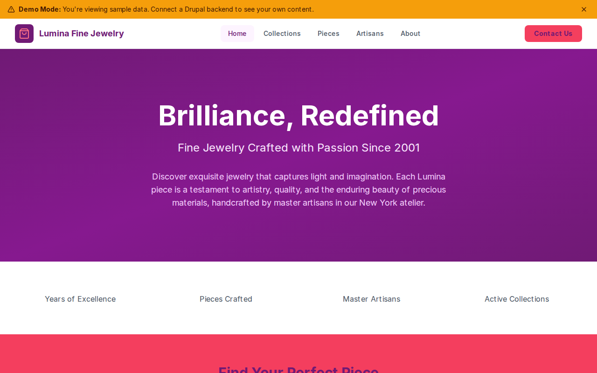

# Decoupled Jewelry

A luxury website starter for fine jewelry brands, artisan jewelers, and high-end retail boutiques. Built with Next.js 15 and Drupal CMS, this starter showcases curated collections, individual pieces with pricing and gemstone details, and the artisans behind each creation.



[](https://vercel.com/new/clone?repository-url=https://github.com/nextagencyio/decoupled-jewelry&project-name=jewelry-site)

## Features

- **Collections** -- Organize jewelry by themed collections with season, piece count, price ranges, and showcase imagery
- **Pieces** -- Detail individual jewelry items with material, gemstone, price, piece type, and collection association
- **Artisans** -- Profile master craftspeople with specialty, years of experience, training origin, and professional photos
- **Homepage** -- Elegant hero section, brand statistics (years, pieces crafted, artisans), featured collections, and call-to-action
- **Basic Pages** -- Static content for About, Contact, policies, and brand storytelling

## Quick Start

### 1. Clone the template

```bash
npx degit nextagencyio/decoupled-jewelry my-jewelry-store
cd my-jewelry-store
npm install
```

### 2. Run interactive setup

```bash
npm run setup
```

This interactive script will:
- Authenticate with Decoupled.io (opens browser)
- Create a new Drupal space
- Wait for provisioning (~90 seconds)
- Configure your `.env.local` file
- Import sample content

### 3. Start development

```bash
npm run dev
```

Visit [http://localhost:3000](http://localhost:3000)

---

## Manual Setup

If you prefer to run each step manually:

<details>
<summary>Click to expand manual setup steps</summary>

### Authenticate with Decoupled.io

```bash
npx decoupled-cli@latest auth login
```

### Create a Drupal space

```bash
npx decoupled-cli@latest spaces create "Lumina Fine Jewelry"
```

Note the space ID returned (e.g., `Space ID: 1234`). Wait ~90 seconds for provisioning.

### Configure environment

```bash
npx decoupled-cli@latest spaces env 1234 --write .env.local
```

### Import content

```bash
npm run setup-content
```

This imports the following sample content:

**Collections:**
- Eternal Garden (Spring/Summer 2026 -- 18 pieces, $1,200-$12,500)
- Midnight Sky (Fall/Winter 2025 -- 14 pieces, $1,950-$15,000)
- Golden Hour (Year-Round -- 22 pieces, $800-$6,500)

**Pieces:**
- Aurora Engagement Ring (Platinum, 1.5ct Diamond -- $8,500)
- Celestial Pendant Necklace (Platinum, Blue Sapphire -- $4,200)
- Soleil Tennis Bracelet (18k Yellow Gold, Citrine & Diamond -- $3,800)
- Flora Drop Earrings (18k Rose Gold, Emerald -- $2,900)
- Luna Cuff Bracelet (Sterling Silver, Moonstone & Diamond -- $1,950)

**Artisans:**
- Isabella Santos (Hand Engraving & Filigree -- 28 years, Florence)
- James Chen (Stone Setting & Gemology -- 15 years, GIA Carlsbad)
- Amara Okafor (Design & Creative Direction -- 20 years, Royal College of Art)

**Pages:**
- About Lumina Fine Jewelry
- Contact Lumina

</details>

## Content Types

### Collection
| Field | Type | Description |
|-------|------|-------------|
| title | string | Collection name |
| body | rich text | Collection narrative and description |
| season | string | Season or availability window |
| piece_count | integer | Number of pieces in collection |
| price_range | string | Price range display text |
| image | image | Collection showcase image |

### Piece
| Field | Type | Description |
|-------|------|-------------|
| title | string | Piece name |
| body | rich text | Detailed piece description |
| collection_name | string | Parent collection name |
| price | string | Retail price |
| material | string | Primary metal/material |
| gemstone | string | Gemstone type and details |
| piece_type | string | Category (Ring, Necklace, Bracelet, Earrings) |
| image | image | Piece photography |

### Artisan
| Field | Type | Description |
|-------|------|-------------|
| title | string | Artisan name |
| body | rich text | Professional biography |
| specialty | string | Craft specialty |
| years_experience | integer | Years of professional experience |
| origin | string | Training institution or location |
| photo | image | Professional portrait |

### Homepage
| Field | Type | Description |
|-------|------|-------------|
| hero_title | string | Main headline |
| hero_subtitle | string | Supporting tagline |
| hero_description | rich text | Hero body copy |
| stats_items | paragraph[] | Brand statistics (number + label) |
| featured_items_title | string | Collections section heading |
| cta_title | string | Call-to-action heading |
| cta_description | rich text | CTA body copy |
| cta_primary / cta_secondary | string | CTA button labels |

## Customization

### Colors & Branding
Edit `tailwind.config.js` to customize the fuchsia and rose color scheme. Update the Header component logo icon and brand name.

### Content Structure
Modify `data/jewelry-content.json` to add or change content types and sample content.

### Components
React components are in `app/components/`. Key files:
- `HomepageRenderer.tsx` -- Landing page with hero, stats, and CTA
- `CollectionCard.tsx` / `PieceCard.tsx` -- Listing cards
- `ArtisanCard.tsx` -- Artisan profile cards
- `Header.tsx` -- Navigation and branding

## Demo Mode

Demo mode allows you to showcase the application without connecting to a Drupal backend.

### Enable Demo Mode

```bash
NEXT_PUBLIC_DEMO_MODE=true
```

### Removing Demo Mode

1. Delete `lib/demo-mode.ts`
2. Delete `data/mock/` directory
3. Delete `app/components/DemoModeBanner.tsx`
4. Remove `DemoModeBanner` from `app/layout.tsx`
5. Remove demo mode checks from `app/api/graphql/route.ts`

## Deployment

### Vercel (Recommended)
[](https://vercel.com/new/clone?repository-url=https://github.com/nextagencyio/decoupled-jewelry)

Set `NEXT_PUBLIC_DEMO_MODE=true` in Vercel environment variables for a demo deployment.

### Other Platforms
Works with any Node.js hosting platform that supports Next.js.

## Documentation

- [Decoupled.io Docs](https://www.decoupled.io/docs)
- [Next.js Documentation](https://nextjs.org/docs)
- [Drupal GraphQL](https://www.decoupled.io/docs/graphql)

## License

MIT
